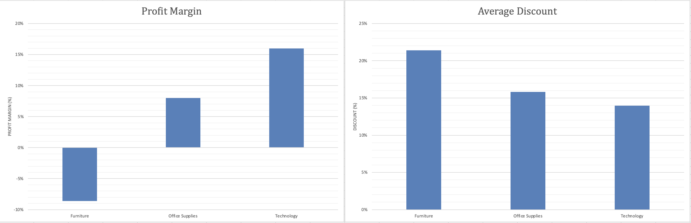

# Retail Sales Profitability Analysis

## What this is

A practice project I built in Excel to work through a full analysis from start to finish: 
cleaning messy data, building a pivot table, calculating real KPIs, making charts, and 
writing up findings.

## About the data

I used Claude to grab and prepare a simplified sample of the public Superstore dataset 
(a well-known retail dataset used a lot in BI tutorials). It trimmed the original down to 
305 rows and 8 columns, and added some data quality issues on purpose (duplicate rows, 
missing values, inconsistent text formatting) so I'd have something real to practice cleaning.

To be clear: the dataset is real, but the mess in it was added intentionally for this 
exercise. I wanted to be upfront about that rather than make it sound like I found messy 
data out in the wild.

## What I did

1. **Cleaned the data**: removed 35 exact duplicate rows and 12 rows with missing 
   Region or Sales values, standardized inconsistent Category text (mixed casing, extra 
   spaces). Went from 305 rows down to 258 clean rows.
2. **Structured it as an Excel Table** so it stays organized and any future rows 
   auto-expand into the analysis.
3. **Built a pivot table** to break down Sales, Profit, and Discount by category.
4. **Added a calculated field** for Profit Margin (Profit ÷ Sales), instead of just 
   looking at raw totals.
5. **Built two charts** (Profit Margin by Category and Average Discount by Category) 
   and cleaned up the formatting: axis labels, percentage formatting, legend removal.
6. **Wrote an executive summary** with the findings, a recommendation, and an honest 
   note on the limitations of a 258-row sample.

## Dashboard

## Key findings

- Technology is the strongest category: $50,495.36 in sales, 15.98% profit margin.
- Office Supplies is doing okay: $16,597.28 in sales, 8.02% margin.
- Furniture is losing money overall: $20,277.95 in sales but a -8.61% margin, a net 
  loss of $1,746.13.
- Furniture also has the highest average discount (21%, vs. 16% and 14% for the other 
  two categories). That's consistent with heavy discounting contributing to the loss, 
  though this dataset alone doesn't prove it caused it.

## Recommendation

Furniture's discount levels are worth reviewing before running more promotions in that 
category. A next step would be breaking it down by sub-category (Chairs, Tables, 
Bookcases) to see if the losses are coming from one specific product line or spread 
across the board.

## Limitations

This is based on a 258-order sample, so the findings show a pattern worth investigating, 
not a complete picture of the business.

## Files

- `Superstore.xlsx`: the full workbook (raw data, pivot analysis, dashboard, and 
  executive summary as separate tabs)
